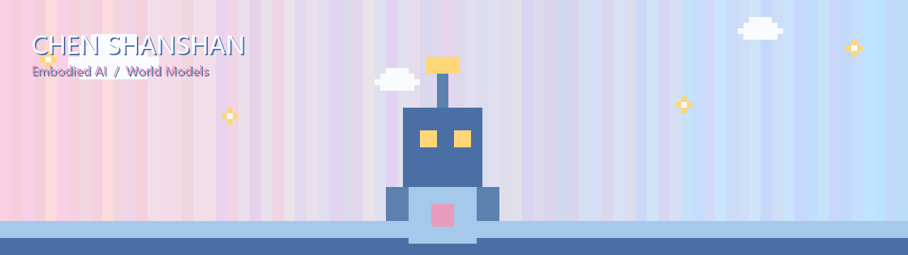

<div align="center">



# 陈杉杉 · Shanshan Chen

**本科在读 · 研究方向：具身智能 / 世界模型 / 机器人强化学习**

*Research Interest: Embodied AI / World Models / Model-Based RL*

```
░▒▓█ 浅粉 × 浅蓝 · 像素风 █▓▒░
```

</div>


## 关于我 · About Me

- 研究方向聚焦 **具身智能（Embodied AI）** 与 **世界模型（World Model）**，探索机器人端到端学习与自主导航
- 独立完成 DreamerV3 世界模型导航系统，正在复现 **UniWM** 统一世界模型（视觉展望 + 规划 + 记忆增强）
- 关注 Model-Based RL、潜在空间想象规划、Sim2Real、视觉表征学习
- 长期目标：从仿真到真实环境的具身智能迁移


## 在研项目 · In-Progress Research

### 基于 DreamerV3 世界模型的居家服务机器人导航系统

[](https://github.com/yugan-tano/home-nav-dreamer)
[](https://github.com/yugan-tano/home-nav-dreamer)
[](https://github.com/yugan-tano/home-nav-dreamer)
[]()

<div align="center">
  
</div>

- 以 **RSSM 世界模型**为核心，实现端到端视觉导航，替代传统「感知—建图—规划—控制」模块化架构
- 潜在空间**多分支想象规划**：导航成功率 **> 90%**，决策效率提升约 **10 倍**
- 完整交付：论文（LaTeX）+ 代码 + 训练数据 + 模型权重

<p align="center">
  <a href="https://github.com/yugan-tano/home-nav-dreamer">查看仓库</a> ·
  <a href="https://github.com/yugan-tano/home-nav-dreamer/releases">模型权重</a>
</p>

### UniWM · 面向视觉导航的统一世界模型

[](https://arxiv.org/abs/2510.08713)
[](https://github.com/yugan-tano/UniWM)
[]()

论文 [UniWM](https://arxiv.org/abs/2510.08713) 的复现与研读：以**单一多模态自回归骨干**统一**视觉展望（Foresight）**与**规划（Planning）**，通过**分层记忆机制**融合短期感知线索与长期轨迹上下文，实现记忆增强的端到端视觉导航。

- 关键技术：Anole-7b · LoRA 微调 · 记忆银行（Memory Bank）· 视觉展望
- 复现进度：`骨架/环境 ██░░ 核心模型 ░░░░ 训练评估 ░░░░`

[ 查看仓库](https://github.com/yugan-tano/UniWM)


## 项目 · Featured Projects

### SmartAgroShield · 猕猴桃病害智能识别与防护

[](https://github.com/yugan-tano/SmartAgroShield)
[](https://github.com/yugan-tano/SmartAgroShield)

基于 **ShuffleNetV2** 的猕猴桃叶片四分类病害识别系统，融合温湿度多模态输入实现环境风险预警，桌面端 + Web 端双形态交付。

- 部署模型 **ShuffleNetV2**（**1.26M** 参数），测试准确率 **85.47%**，推理延迟 **~48.6ms**/图
- 四分类病害识别：褐斑病 / 灰霉病 / 健康 / 溃疡病
- 多模态融合：图像识别 + 温湿度输入 → 环境风险等级与防治建议
- 双端交付：Tkinter 桌面端（PyInstaller 打包 exe）+ Flask Web 端

[ 查看仓库](https://github.com/yugan-tano/SmartAgroShield)

### 猕猴桃溃疡病图像分类 · Kiwi Canker Classification

[](https://github.com/yugan-tano/kiwi_canker_classification)

基于 **SE-ResNet**（Squeeze-and-Excitation + ResNet34）的猕猴桃溃疡病图像分类模型，含数据预处理、训练脚本、评估报告与可视化。

[ 查看仓库](https://github.com/yugan-tano/kiwi_canker_classification)

### netSeamLess · 远程无缝办公

轻量设备远程调用高性能桌面算力的无缝办公方案（概念与早期开发阶段）。

[ 查看仓库](https://github.com/yugan-tano/netSeamLess)


## 学习笔记 · Learning Record

[](https://github.com/yugan-tano/learning-record)
[](https://github.com/yugan-tano/learning-record)

Python、数据分析、算法与深度学习的系统学习笔记。

[ 查看笔记](https://github.com/yugan-tano/learning-record)


## 技术栈 · Tech Stack

<div align="center">

[](https://github.com/yugan-tano)
[](https://github.com/yugan-tano)
[](https://github.com/yugan-tano)
[](https://github.com/yugan-tano)
[](https://github.com/yugan-tano)

</div>

<div align="center">

```
░▒▓█ 像素风 · 浅粉浅蓝 █▓▒░
```

联系我 · Reach me: 见仓库主页或提交 Issue

</div>
